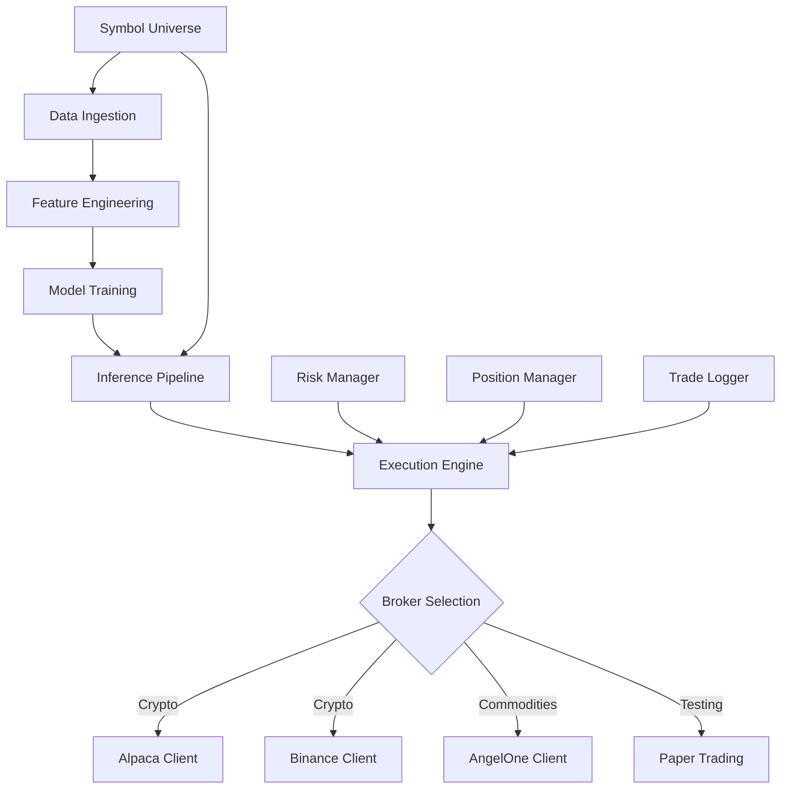

# Crypto-Commodities Trading System

> **AI-Powered Multi-Asset Trading Platform** with Machine Learning predictions, multiple broker integrations, and automated execution for both cryptocurrencies and commodities.

---

## 🎯 Overview

This is a comprehensive automated trading system that combines machine learning predictions with real-time execution across multiple asset classes and brokers. The system supports:

- **Cryptocurrencies**: Trade via Alpaca (paper/live) or Binance
- **Commodities**: Trade via Angel One (MCX) or Paper Trading simulator
- **Multiple Horizons**: Intraday (1-day), Short-term (4-day), Long-term (30-day)
- **Ensemble ML Models**: Random Forest, LightGBM, XGBoost, DQN (Deep Q-Network)
- **Risk Management**: Position sizing, stop-loss, take-profit, cooldown periods
- **Live Monitoring**: Real-time predictions, trade logging, performance tracking

---

## 📊 System Architecture



---

## 🔄 Complete Data Flow

### 1. **Data Ingestion** (`fetchers.py`)

**Purpose**: Fetch historical and live market data from multiple sources

**Data Sources**:
- **Crypto**: Binance REST API, Binance WebSocket, Alpaca API
- **Commodities**: Yahoo Finance (yfinance), Angel One API

**Process**:
1. Fetch historical OHLCV candles (10+ years of data)
2. Normalize timestamps to UTC ISO 8601 format
3. Validate candles (price sanity checks, duplicate removal)
4. Store in `data/json/raw/{asset_type}/{source}/{symbol}/{timeframe}/data.json`
5. Generate manifest files with metadata

**Key Functions**:
- `fetch_binance_historical()` - Bulk historical crypto data
- `fetch_yahoo_historical()` - Commodity futures data
- `fetch_binance_live()` - Real-time crypto updates via WebSocket
- `validate_candle()` - Data quality checks

---

### 2. **Feature Engineering** (`fetchers.py`, `ml/context_features.py`)

**Purpose**: Transform raw OHLCV data into predictive features

**Feature Categories**:

#### **Technical Indicators** (60+ features)
- **Trend**: SMA (20, 50, 200), EMA (12, 26), MACD, ADX
- **Momentum**: RSI (14), Stochastic, CCI, Williams %R
- **Volatility**: Bollinger Bands, ATR, Historical Volatility
- **Volume**: OBV, Volume SMA, Volume Rate of Change
- **Price Action**: Price vs SMA deviations, candle patterns

#### **Context Features** (Optional)
- **Macro Indicators**: VIX, DXY (Dollar Index), Treasury Yields
- **Spreads**: BTC-ETH correlation, crypto-commodity relationships
- **Regime Detection**: Bull/bear market classification
- **Intraday Aggregates**: 4h and 1h timeframe features

**Storage**: `data/features/{asset_type}/{symbol}/{timeframe}/features.json`

**Process**:
1. Load raw candles from `data.json`
2. Calculate rolling indicators (SMA, RSI, etc.)
3. Compute derived features (price momentum, volatility ratios)
4. Add context features if enabled
5. Save feature matrix with timestamps

---

### 3. **Model Training** (`train_models.py`, `ml/trainers.py`)

**Purpose**: Train ensemble ML models to predict future price returns

**Model Architecture**:

#### **Regression Models** (Predict % Return)
1. **Random Forest**: 100 trees, max depth 8, strong regularization
2. **LightGBM**: Gradient boosting, early stopping, leaf-wise growth
3. **XGBoost**: Extreme gradient boosting, L1/L2 regularization
4. **DQN (Deep Q-Network)**: Reinforcement learning agent (Stable-Baselines3)

#### **Training Pipeline**:

```
1. Load features.json → Feature Matrix (X)
2. Generate target labels (Y):
   - Intraday: 1-day forward return
   - Short: 4-day forward return
   - Long: 30-day forward return
3. Split data:
   - Train: 60%
   - Validation: 20%
   - Test: 20%
4. Feature Selection:
   - Variance filtering (remove low-variance features)
   - Correlation ranking (top features vs target)
   - Importance filtering (LightGBM feature importance)
   - Final: Top 50-100 features
5. Scaling:
   - RobustScaler (handles outliers)
   - Fit on train, transform val/test
6. Train each model:
   - Random Forest → train_random_forest()
   - LightGBM → train_lightgbm()
   - XGBoost → train_xgboost()
   - DQN → train_dqn()
7. Evaluate on test set:
   - R² (coefficient of determination)
   - MAE (mean absolute error)
   - RMSE (root mean squared error)
   - Directional Accuracy (% of correct up/down predictions)
8. Tradability Check:
   - Min R² > 0.15
   - Min Directional Accuracy > 52%
   - Max overfitting gap < 8%
9. Save models:
   - models/{asset_type}/{symbol}/{timeframe}/{horizon}/
   - Files: random_forest.joblib, lightgbm.joblib, xgboost.joblib, dqn.joblib
   - Metadata: metrics.json, summary.json
```

**Overfitting Prevention**:
- Strong regularization (max_depth, min_samples_leaf, learning_rate)
- Early stopping on validation set
- Walk-forward cross-validation
- Train-val-test gap monitoring

---

### 4. **Inference Pipeline** (`ml/inference.py`)

**Purpose**: Load trained models and generate real-time predictions

**Consensus Mechanism**:

```
1. Load all trained models for a symbol
2. Prepare latest feature row (from features.json)
3. Scale features using saved scaler
4. Get predictions from each model:
   - Random Forest → predicted_return_rf
   - LightGBM → predicted_return_lgb
   - XGBoost → predicted_return_xgb
   - DQN → predicted_return_dqn
5. Compute weighted consensus:
   - Weight by model R² (better models get more weight)
   - Average weighted predictions
   - Clamp to realistic range (±5% for intraday, ±12% for long)
6. Calculate confidence:
   - Agreement ratio (how similar are predictions?)
   - Model count (more models = higher confidence)
   - Volatility adjustment (lower confidence in high volatility)
   - Dynamic cap: 60-90% based on conditions
7. Determine action:
   - LONG: consensus_return > min_confidence
   - FLAT: consensus_return between -min_confidence and +min_confidence
   - SHORT: consensus_return < -min_confidence (if enabled)
8. Calculate position size:
   - Base: max_notional_per_symbol_pct * equity
   - Scaled by confidence (higher confidence = larger position)
   - Clamped to risk limits
```

**Output**:
```json
{
  "consensus_action": "LONG",
  "consensus_return": 0.0234,
  "consensus_confidence": 0.67,
  "position_size": 0.08,
  "predicted_price": 45678.90,
  "model_outputs": {
    "random_forest": {"predicted_return": 0.025, "weight": 0.3},
    "lightgbm": {"predicted_return": 0.022, "weight": 0.35},
    "xgboost": {"predicted_return": 0.024, "weight": 0.25},
    "dqn": {"predicted_return": 0.021, "weight": 0.1}
  }
}
```

---

### 5. **Execution Engine** (`trading/execution_engine.py`)

**Purpose**: Convert ML predictions into actual broker orders

**Execution Logic**:

```
1. Get consensus from inference pipeline
2. Fetch current broker position (if any)
3. Compare desired state vs current state:

   IF consensus_action == "LONG" AND no position:
      → BUY (open long position)
   
   IF consensus_action == "LONG" AND have LONG position:
      → HOLD (check profit target / stop loss)
   
   IF consensus_action == "FLAT" AND have LONG position:
      → SELL (close position)
   
   IF consensus_action == "SHORT" AND no position:
      → SELL (open short position, if enabled)
   
   IF consensus_action == "SHORT" AND have SHORT position:
      → HOLD (check profit target / stop loss)

4. Calculate order size:
   - Notional = position_size * equity
   - Quantity = notional / current_price
   - Round to lot size (for commodities)

5. Submit order to broker:
   - Market order for immediate execution
   - Attach stop-loss order (broker-level protection)
   - Attach take-profit order (optional)

6. Track position:
   - Entry price, quantity, timestamp
   - Profit target price
   - Stop loss price
   - Horizon profile

7. Monitor position:
   - Check profit target hit → SELL
   - Check stop loss hit → SELL
   - Check consensus flip → SELL
   - Check cooldown period → SKIP

8. Log trade:
   - logs/trading/{broker}_trades.jsonl
   - Entry: timestamp, symbol, side, quantity, price
   - Exit: timestamp, exit_price, realized_pl, realized_pl_pct
```

**Risk Management**:
- **Position Sizing**: Max 5-18% of equity per symbol (horizon-dependent)
- **Stop Loss**: 6-8% from entry (crypto), 2% (commodities)
- **Take Profit**: Horizon-specific (intraday: 3%, short: 6%, long: 12%)
- **Cooldown**: 1-hour after loss, 30-min after profit
- **Max Exposure**: 50% of total equity across all positions

---

### 6. **Broker Integrations**

#### **Alpaca Client** (`trading/alpaca_client.py`)
- **Asset Class**: Cryptocurrencies (BTC, ETH, etc.)
- **Account Type**: Paper trading (default) or Live
- **Authentication**: API Key + Secret Key (from `.env`)
- **Endpoints**:
  - `GET /v2/account` - Account balance, buying power
  - `GET /v2/positions` - Open positions
  - `POST /v2/orders` - Submit market/limit orders
  - `GET /v2/orders` - Order history
- **Features**:
  - Fractional shares supported
  - Stop-loss and take-profit orders
  - Real-time position tracking

#### **Binance Client** (`trading/binance_client.py`, `binance/binance_client.py`)
- **Asset Class**: Cryptocurrencies (spot trading)
- **Account Type**: Testnet (paper) or Live
- **Authentication**: API Key + Secret Key
- **Endpoints**:
  - `GET /api/v3/account` - Account info
  - `GET /api/v3/openOrders` - Open orders
  - `POST /api/v3/order` - Place order
  - `GET /api/v3/ticker/price` - Current prices
- **Features**:
  - Lower fees than Alpaca
  - More crypto pairs available
  - WebSocket for live data

#### **Angel One Client** (`trading/angelone_client.py`)
- **Asset Class**: MCX Commodity Futures (Gold, Silver, Crude Oil)
- **Account Type**: Live trading (real money)
- **Authentication**: API Key + Client ID + Password + TOTP
- **Endpoints**:
  - `POST /rest/auth/login` - Login with TOTP
  - `GET /rest/secure/rmsLimit` - Account balance
  - `GET /rest/secure/orderBook` - Positions
  - `POST /rest/secure/order/placeOrder` - Place order
- **Features**:
  - MCX contract mapping (e.g., GOLDM → GOLDFEB24)
  - Lot size rounding
  - Real-time LTP (Last Traded Price)
  - TOTP-based authentication

#### **Paper Trading Client** (`trading/paper_trading_client.py`)
- **Asset Class**: Commodities (for testing)
- **Account Type**: Simulated (no real money)
- **Features**:
  - Local position tracking
  - Simulated fills at market price
  - Commission simulation (0.1% default)
  - No external dependencies
  - Perfect for testing strategies

---

## 🚀 Usage

### **1. Setup**

```bash
# Install dependencies
pip install -r requirements.txt

# Configure environment variables
cp .env.example .env
# Edit .env with your API keys:
# - ALPACA_API_KEY, ALPACA_SECRET_KEY
# - BINANCE_API_KEY, BINANCE_SECRET_KEY
# - ANGELONE_API_KEY, ANGELONE_CLIENT_ID, ANGELONE_PASSWORD, ANGELONE_TOTP_SECRET
```

---

### **2. End-to-End Crypto Trading (Alpaca)**

```bash
python end_to_end_crypto.py
```

**What it does**:
1. Prompts for crypto symbols (e.g., BTC-USDT, ETH-USDT)
2. Prompts for horizon (intraday, short, long)
3. Fetches historical data from Binance
4. Generates features
5. Trains models (if not already trained)
6. Ranks symbols by model performance
7. Asks which symbols to trade
8. Runs live trading loop:
   - Fetches latest data
   - Regenerates features
   - Runs inference
   - Executes trades on Alpaca
   - Monitors positions
   - Logs trades

**Interactive Example**:
```
Enter crypto symbols (comma-separated, e.g., BTC-USDT,ETH-USDT): BTC-USDT,ETH-USDT
Select horizon (intraday/short/long) [default: short]: short
Fetching data for BTC-USDT...
Training models for BTC-USDT...
Model R²: 0.23, Directional Accuracy: 54.2%
✅ BTC-USDT is tradable

Ranked Symbols:
1. BTC-USDT (R²: 0.23, DA: 54.2%)
2. ETH-USDT (R²: 0.19, DA: 52.8%)

Enter symbols to trade (comma-separated): BTC-USDT

Starting live trading...
[2026-01-21 18:00:00] BTC-USDT: LONG signal (confidence: 67%)
[2026-01-21 18:00:01] Opened LONG position: 0.05 BTC @ $45,000
```

---

### **3. End-to-End Commodities Trading (Angel One or Paper)**

```bash
python end_to_end_commodities.py
```

**What it does**:
1. Prompts for commodity symbols (e.g., GC=F for Gold, SI=F for Silver)
2. Prompts for horizon
3. Prompts for broker (angelone or paper)
4. Fetches historical data from Yahoo Finance
5. Trains models
6. Runs live trading loop with selected broker

**Interactive Example**:
```
Enter commodity symbols (comma-separated, e.g., GC=F,SI=F): GC=F
Select horizon (intraday/short/long) [default: short]: short
Select broker (angelone/paper) [default: paper]: paper

Training models for GC=F...
✅ GC=F is tradable (R²: 0.18, DA: 53.1%)

Starting paper trading...
[2026-01-21 18:00:00] GC=F: LONG signal (confidence: 62%)
[2026-01-21 18:00:01] Simulated BUY: 10 lots @ $2,050/oz
```

---

### **4. Binance Trading**

```bash
cd binance
python end_to_end_binance.py
```

**What it does**:
- Same as `end_to_end_crypto.py` but uses Binance instead of Alpaca
- Lower fees, more crypto pairs
- Supports Binance Testnet for paper trading

---

### **5. Live Trading Loop** (Advanced)

```bash
python live_trader.py
```

**What it does**:
- Discovers all symbols with trained models
- Runs continuous trading loop (every 5 minutes)
- Monitors all positions
- Auto-exits on profit target or stop loss
- Logs all trades to `logs/trading/crypto_trades.jsonl`

**Command-line options**:
```bash
# Trade specific symbols only
python live_trader.py --symbols BTC-USDT,ETH-USDT

# Use specific horizon
python live_trader.py --horizon long

# Set custom profit target
python live_trader.py --profit-target 0.10  # 10%

# Set custom stop loss
python live_trader.py --stop-loss 0.05  # 5%

# Dry run (no actual trades)
python live_trader.py --dry-run
```

---

## 📁 Project Structure

```
Crypto-Commodities/
├── config.py                      # Configuration (API URLs, timeframes)
├── requirements.txt               # Python dependencies
├── .env                          # API keys (not in repo)
├── .gitignore                    # Git ignore rules
│
├── end_to_end_crypto.py          # Main entry: Crypto trading (Alpaca)
├── end_to_end_commodities.py     # Main entry: Commodities trading
├── live_trader.py                # Continuous trading loop
├── fetchers.py                   # Data ingestion + feature generation
├── train_models.py               # Model training orchestrator
│
├── binance/                      # Binance-specific trading
│   ├── end_to_end_binance.py     # Binance trading flow
│   ├── binance_client.py         # Binance API client
│   └── dashboard.py              # Trading dashboard
│
├── trading/                      # Trading execution layer
│   ├── execution_engine.py       # Core execution logic
│   ├── alpaca_client.py          # Alpaca broker client
│   ├── binance_client.py         # Binance broker client
│   ├── angelone_client.py        # Angel One broker client
│   ├── paper_trading_client.py   # Paper trading simulator
│   ├── broker_interface.py       # Broker abstraction
│   ├── position_manager.py       # Position tracking
│   ├── symbol_universe.py        # Symbol mappings (4600+ symbols)
│   ├── mcx_symbol_mapper.py      # MCX contract mapping
│   └── trade_logger.py           # Trade logging
│
├── ml/                           # Machine learning pipeline
│   ├── inference.py              # Inference + consensus
│   ├── trainers.py               # Model training functions
│   ├── data_loader.py            # Data loading utilities
│   ├── horizons.py               # Horizon profiles (intraday/short/long)
│   ├── targets.py                # Target label generation
│   ├── risk.py                   # Risk management config
│   ├── context_features.py       # Context feature engineering
│   ├── hyperopt.py               # Hyperparameter optimization
│   └── bucket_logger.py          # Training metrics logging
│
├── core/                         # Core utilities
│   ├── model_paths.py            # Model path resolution
│   └── system_bootstrap.py       # System initialization
│
├── api/                          # API server (optional)
│   └── server.py                 # REST API for predictions
│
├── data/                         # Data storage (ignored in git)
│   ├── json/raw/                 # Raw OHLCV candles
│   │   ├── crypto/binance/       # Crypto data from Binance
│   │   └── commodities/yahoo_chart/  # Commodity data from Yahoo
│   └── features/                 # Feature matrices
│       ├── crypto/               # Crypto features
│       └── commodities/          # Commodity features
│
├── models/                       # Trained models (ignored in git)
│   ├── crypto/                   # Crypto models
│   │   └── {symbol}/{timeframe}/{horizon}/
│   │       ├── random_forest.joblib
│   │       ├── lightgbm.joblib
│   │       ├── xgboost.joblib
│   │       ├── dqn.joblib
│   │       ├── feature_scaler.joblib
│   │       ├── metrics.json
│   │       └── summary.json
│   └── commodities/              # Commodity models
│
└── logs/                         # Logs (ignored in git)
    ├── trading/                  # Trade logs
    │   ├── crypto_trades.jsonl   # Alpaca/Binance trades
    │   ├── commodity_trades.jsonl # Angel One trades
    │   └── paper_trades.jsonl    # Paper trading logs
    └── training/                 # Training logs
        └── {asset_type}/{symbol}/{timeframe}/
            └── training_log.json
```

---

## 🎓 Key Concepts

### **Horizon Profiles**

The system supports three prediction horizons, each with different trading characteristics:

| Horizon | Prediction Window | Typical Hold Time | Position Size | Stop Loss | Trading Style |
|---------|------------------|-------------------|---------------|-----------|---------------|
| **Intraday** | 1 day | Hours to 1 day | 5% | 8% | Scalping - many small trades |
| **Short** | 4 days | 3-5 days | 10% | 6% | Swing trading - hold for days |
| **Long** | 30 days | Weeks to months | 18% | 7% | Trend following - ride big moves |

**How to choose**:
- **Intraday**: High-frequency trading, need constant monitoring
- **Short**: Balanced approach, good for part-time traders
- **Long**: Low-frequency, suitable for long-term investors

---

### **Symbol Universe**

The system includes **4,600+ pre-configured symbols** across:

**Cryptocurrencies** (via Alpaca/Binance):
- Major: BTC, ETH, SOL, AVAX, MATIC, DOT, LINK, UNI, AAVE
- Stablecoins: USDT, USDC pairs
- DeFi: SUSHI, CRV, YFI, MKR
- Meme: DOGE, SHIB, PEPE

**Commodities** (via Angel One/Yahoo):
- Precious Metals: Gold (GC=F), Silver (SI=F), Platinum, Palladium
- Energy: Crude Oil (CL=F), Natural Gas (NG=F), Heating Oil
- Agriculture: Wheat, Corn, Soybeans, Coffee, Sugar
- MCX Futures: GOLDM, SILVERM, CRUDEOILM

**Symbol Mapping**:
- `data_symbol`: Used for data/features (e.g., `BTC-USDT`)
- `trading_symbol`: Used for broker orders (e.g., `BTCUSD` for Alpaca, `BTCUSDT` for Binance)

---

### **Model Ensemble**

Each symbol has **4 trained models** that vote on predictions:

1. **Random Forest**: Robust, handles non-linear relationships
2. **LightGBM**: Fast, efficient gradient boosting
3. **XGBoost**: Powerful, regularized boosting
4. **DQN**: Reinforcement learning, learns from market feedback

**Consensus Voting**:
- Each model predicts a % return (e.g., +2.3%)
- Predictions are weighted by model R² (better models get more weight)
- Final consensus is the weighted average
- Confidence is based on agreement (similar predictions = high confidence)

**Example**:
```
Random Forest: +2.5% (R²: 0.25, weight: 0.30)
LightGBM:      +2.2% (R²: 0.22, weight: 0.27)
XGBoost:       +2.4% (R²: 0.23, weight: 0.28)
DQN:           +2.1% (R²: 0.15, weight: 0.15)

Consensus: +2.34% (confidence: 67%)
Action: LONG
```

---

### **Risk Management**

**Position Sizing**:
```python
notional = equity * position_size_pct * confidence
quantity = notional / current_price
```

**Stop Loss** (Broker-level):
- Automatically placed when position opens
- Protects against large losses
- Executes even if bot is offline

**Take Profit** (Horizon-specific):
- Intraday: 3% profit target
- Short: 6% profit target
- Long: 12% profit target

**Cooldown Periods**:
- After loss: 1 hour (prevent revenge trading)
- After profit: 30 minutes (prevent overtrading)

**Max Exposure**:
- Total positions: 50% of equity
- Per symbol: 5-18% (horizon-dependent)

---

## 📈 Performance Metrics

**Model Evaluation**:
- **R² (Coefficient of Determination)**: How well the model explains variance (target: >0.15)
- **Directional Accuracy**: % of correct up/down predictions (target: >52%)
- **MAE (Mean Absolute Error)**: Average prediction error
- **RMSE (Root Mean Squared Error)**: Penalizes large errors

**Trading Metrics** (from logs):
- **Win Rate**: % of profitable trades
- **Average Profit**: Mean profit per winning trade
- **Average Loss**: Mean loss per losing trade
- **Profit Factor**: Total profit / Total loss
- **Sharpe Ratio**: Risk-adjusted returns

---

## 🛠️ Advanced Features

### **Hyperparameter Optimization** (Optuna)

```bash
# Enable hyperopt in train_models.py
ENABLE_HYPEROPT = True
HYPEROPT_TRIALS = 20
```

Automatically tunes:
- Random Forest: n_estimators, max_depth, min_samples_split
- LightGBM: num_leaves, learning_rate, feature_fraction
- XGBoost: max_depth, learning_rate, subsample

### **Context Features** (Macro Indicators)

```python
# Enable in train_models.py
CONTEXT_CONFIG = ContextFeatureConfig(
    include_macro=True,           # VIX, DXY, Treasury Yields
    include_spreads=True,         # BTC-ETH correlation
    include_volatility_indices=True,
    include_regime_features=True, # Bull/bear market detection
)
```

### **Walk-Forward Validation**

- Splits data into 5 time-based folds
- Trains on past data, validates on future data
- Prevents look-ahead bias
- More realistic performance estimates

---

## 🔒 Security Best Practices

1. **Never commit API keys**: Use `.env` file (already in `.gitignore`)
2. **Start with paper trading**: Test strategies before going live
3. **Use stop losses**: Always protect your capital
4. **Monitor positions**: Check logs regularly
5. **Start small**: Begin with small position sizes
6. **Diversify**: Don't put all capital in one symbol

---

## 🐛 Troubleshooting

**Issue**: Models not training
- **Solution**: Check if features.json exists, ensure enough historical data (>1 year)

**Issue**: Alpaca authentication failed
- **Solution**: Verify API keys in `.env`, check if paper trading is enabled

**Issue**: Angel One TOTP error
- **Solution**: Regenerate TOTP secret, ensure system time is synced

**Issue**: Predictions seem unrealistic
- **Solution**: Check model metrics (R², DA), retrain if overfitting detected

**Issue**: Trades not executing
- **Solution**: Check broker connection, verify symbol format, check buying power

---

## 📚 Additional Resources

- **Alpaca API Docs**: https://alpaca.markets/docs/
- **Binance API Docs**: https://binance-docs.github.io/apidocs/
- **Angel One API Docs**: https://smartapi.angelbroking.com/docs
- **Stable-Baselines3 (DQN)**: https://stable-baselines3.readthedocs.io/
- **LightGBM**: https://lightgbm.readthedocs.io/
- **XGBoost**: https://xgboost.readthedocs.io/

---

## 📝 License

This project is for educational and research purposes. Use at your own risk. Trading involves substantial risk of loss.

---

## 🤝 Contributing

This is a personal trading system. Feel free to fork and customize for your own use.

---

## ⚠️ Disclaimer

**IMPORTANT**: This software is provided "as is" without warranty of any kind. Trading cryptocurrencies and commodities involves substantial risk of loss. Past performance does not guarantee future results. Only trade with money you can afford to lose. The authors are not responsible for any financial losses incurred through the use of this software.

---

## 📧 Support

For questions or issues, please open a GitHub issue or contact the repository owner.

---

**Happy Trading! 🚀📈**
